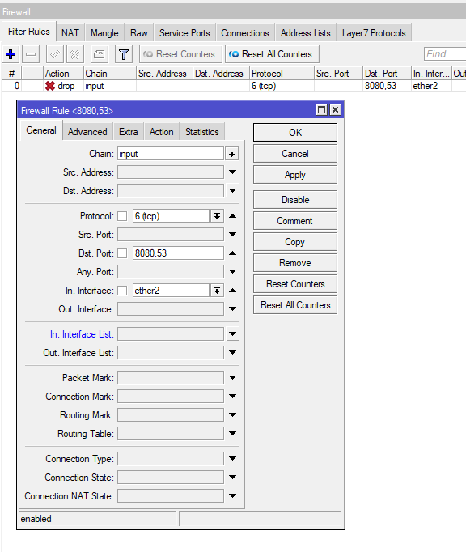

# LAB-31-Secure-Local-Network
Selasa 19 Agustus 2025  

# How to Secure Local Network on Mikrotik  
  **1. Pasang admin password**  
     Cara pertama kita bisa set admin password, karna defaultnya kosong.    
       
  **2. Ganti username dan password Mikrotik**  
     Cara kedua kita bisa buat user dan password lalu disable **admin**.  
       
  **3. Disable service yang tidak diperlukan.**  
     Selanjutnya kita bisa mematikan dan menyalakan service yang hanya digunakan saja di **IP > SERVICES**. disini saya hanya menyalakan service winbox saja. Jadi kita/orang lain tidak bisa mengakses mikrotik selain melalui Winbox.  
       
     Selain mematikan service, kita juga bisa menganti portnya supaya lebih aman.  
       
  **4. Non-Aktifkan atau Ubah Fitur MAC Server**  
     Dengan melakukan disable pada discovery interface bukan berarti Router tidak bisa di remote menggunakan MAC-Address. Jika menginginkan Router tidak bisa diremote menggunakan MAC-Address baik melalui Winbox ataupun via telnet, matikan Fitur MAC-Server di Router. **Tools > MAC-Server**.  
       
  **5. Aktifkan Firewall Filter Untuk Akses Service Router (DNS dan Web Proxy)**
     Router Mikrotik yang kita tempatkan sebagai Gateway Utama, sering mengaktifkan fitur Allow-remote-request DNS dan web proxy. Kedua fitur tersebut bisa dimanfaatkan oleh pihak luar terutama web proxy yang kadang membuat trafik international kita sering penuh padahal tidak ada user lokal yang menggunakannya. Untuk mengatasi hal tersebut kita harus mengaktifkan filter pada Firewall agar pihak luar tidak bisa memanfaatkan DNS kita dan Web Proxy kita.  
       
Dan buat juga action drop untuk trafik DNS yang menggunakan protocol udp.  
       
  **6. Non-Aktifkan Btest Server**  
     Router Mikrotik juga memiliki fitur Btest Server, yang bisa digunakan untuk melakukan test koneksi yang sudah terbentuk. Pengaturan dapat dilakukan pada menu **Tools > BTest Server**.   
        
  **7. Lakukan Backup secara berkala serta Enkripsi dan Ambil File backupnya**  
      Agar tidak perlu konfigurasi ulang sebaiknya kita lakukan Backup secara berkala. Apalagi setelah selesai konfigurasi lakukan backup konfigurasi, dan jangan lupa pindahkan file backup tersebut ke PC atau laptop.    
  **8.Amankan Fisik Router**  
Mikrotik membutuhkan perawatan Fisik seperti :  
- Proteksi kabel power agar jangan terlalu sering di cabut colok  
- Ruang pendingin untuk menjaga suhu perangkat mikrotik  
- Perlindungan terhadap lonjangan listrik menggunakan UPS, atau yang melewati POE sebaiknya gunakan Arester.  

# Kesimpulan
  Kita harus memastikan bahwa router kita harus selalu aman, jangan sampai diakses dan disalah gunakan oleh orang yang tidak bertanggung jawab. Mengamankan router juga ada banyak cara, mulai dari menganti user dan password sampai memelihara hardware.   
  
# Sumber
Citraweb - https://citraweb.com/artikel_lihat.php?id=263  
